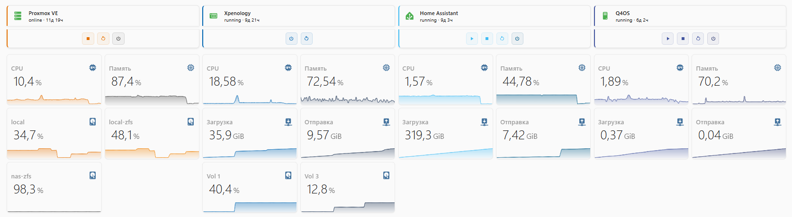

<p align="center">
  
  
  
</p>

<h1 align="center">🖥️ Server Monitor PRO</h1>

<p align="center">
  Панель мониторинга Proxmox-инфраструктуры в стиле Windows 11:<br>
  4 колонки серверов, кнопки управления в шапке, фирменные цвета брендов<br>
  <i>Один YAML-файл · четыре зависимости из HACS · адаптив к теме</i>
</p>


<p align="center">

  
</p>

## ✨ Что внутри

- 🖥️ **4 сервера** — Hypervisor, NAS, Home Assistant OS, Desktop VM
- 🎨 **Фирменные цвета** — каждая колонка в айдентике бренда (Proxmox 🟠, NAS 🔵, HA 🔷, Desktop 🟣)
- 🎛️ **Кнопки в шапке** — управление VM (Start/Stop/Reboot/Shutdown) прямо в заголовке, подтверждение для опасных действий
- 📊 **Графики** — CPU, RAM, Network I/O, Storage с компактным представлением 24 часа
- 🪟 **Стиль Windows 11** — скругления 8px, Segoe UI Variable, мягкие тени, полупрозрачные кнопки как в таскбаре
- 🌓 **Адаптив к теме** — поверхности через `var(--ha-card-background)`, корректно в светлой и тёмной
- 🔒 **Подтверждения** — все shutdown/reboot требуют подтверждения
- 📱 **Адаптивность** — 4 колонки на десктопе, стек на мобильных

## 🧩 Требования

- Home Assistant **2024.8+**
- HACS (Frontend): **mushroom-cards**, **card-mod**, **mini-graph-card**, **button-card**
- Интеграция с Proxmox VE (любая: `proxmoxve`, REST API, SNMP, Glances)
- Entity-сенсоры для каждой ВМ: status, uptime, cpu, memory, network, storage, кнопки управления

## 🚀 Установка

1. HACS → Frontend → установите:
   - **Mushroom** (piitaya/lovelace-mushroom)
   - **card-mod** (thomasloven/lovelace-card-mod)
   - **mini-graph-card** (kalkih/mini-graph-card)
   - **button-card** (custom-cards/button-card)

2. Скопируйте `lovelace/server_monitor_card.yaml` в редактор дашборда:
   - Откройте дашборд → ⋮ → Редактировать → + Добавить карточку → Вручную
   - Вставьте YAML-код

3. Создайте в HA сенсоры и кнопки согласно таблице ниже, либо замените entity_id в YAML на свои существующие.

4. Сохраните и обновите страницу (Ctrl+Shift+R).

## 📋 Таблица маппинга entity_id

Карточка ожидает **единообразные имена** с префиксами `proxmox_`, `nas_`, `ha_`, `desktop_`. Если у вас другие имена — замените их глобальной заменой в YAML.

### Hypervisor (Proxmox VE) 🟠

| Назначение | entity_id в карточке | Что это |
|---|---|---|
| Статус | `sensor.proxmox_status` | `running` / `stopped` / `unknown` |
| Uptime | `sensor.proxmox_uptime` | часы с момента запуска |
| CPU | `sensor.proxmox_cpu_usage` | % загрузки процессора |
| RAM | `sensor.proxmox_memory_usage` | % использования памяти |
| Storage local | `sensor.proxmox_local_storage` | % заполнения локального хранилища |
| Storage local-zfs | `sensor.proxmox_local_zfs` | % заполнения ZFS пула |
| Storage nas-zfs | `sensor.proxmox_nas_zfs` | % заполнения NAS-ZFS пула |
| Кнопка Stop | `button.proxmox_stop` | остановить гипервизор |
| Кнопка Reboot | `button.proxmox_reboot` | перезапустить гипервизор |
| Кнопка Shutdown | `button.proxmox_shutdown` | выключить гипервизор |

### NAS (Xpenology / Synology / TrueNAS) 🔵

| Назначение | entity_id в карточке | Что это |
|---|---|---|
| Статус | `sensor.nas_status` | `running` / `stopped` |
| Uptime | `sensor.nas_uptime` | часы с момента запуска |
| CPU | `sensor.nas_cpu_usage` | % загрузки процессора |
| RAM | `sensor.nas_memory_usage` | % использования памяти |
| Network ↓ | `sensor.nas_network_input` | входящий трафик |
| Network ↑ | `sensor.nas_network_output` | исходящий трафик |
| Volume 1 | `sensor.nas_volume_1` | использование тома 1 |
| Volume 2 | `sensor.nas_volume_2` | использование тома 2 |
| Кнопка Reboot | `button.nas_reboot` | перезапустить NAS |
| Кнопка Shutdown | `button.nas_shutdown` | выключить NAS |

### Home Assistant OS 🔷

| Назначение | entity_id в карточке | Что это |
|---|---|---|
| Статус | `sensor.ha_status` | `running` / `stopped` |
| Uptime | `sensor.ha_uptime` | часы с момента запуска |
| CPU | `sensor.ha_cpu_usage` | % загрузки процессора |
| RAM | `sensor.ha_memory_usage` | % использования памяти |
| Network ↓ | `sensor.ha_network_input` | входящий трафик |
| Network ↑ | `sensor.ha_network_output` | исходящий трафик |
| Кнопка Start | `button.ha_start` | запустить VM |
| Кнопка Stop | `button.ha_stop` | остановить VM |
| Кнопка Reboot | `button.ha_reboot` | перезапустить VM |
| Кнопка Shutdown | `button.ha_shutdown` | выключить VM |

### Desktop VM (Q4OS / Windows / Ubuntu) 🟣

| Назначение | entity_id в карточке | Что это |
|---|---|---|
| Статус | `sensor.desktop_status` | `running` / `stopped` |
| Uptime | `sensor.desktop_uptime` | часы с момента запуска |
| CPU | `sensor.desktop_cpu_usage` | % загрузки процессора |
| RAM | `sensor.desktop_memory_usage` | % использования памяти |
| Network ↓ | `sensor.desktop_network_input` | входящий трафик |
| Network ↑ | `sensor.desktop_network_output` | исходящий трафик |
| Кнопка Start | `button.desktop_start` | запустить VM |
| Кнопка Stop | `button.desktop_stop` | остановить VM |
| Кнопка Reboot | `button.desktop_reboot` | перезапустить VM |
| Кнопка Shutdown | `button.desktop_shutdown` | выключить VM |

## 🛠 Как получить сенсоры Proxmox

### Вариант 1: HACS-интеграция ProxmoxVE (рекомендуется)
Установите [`proxmoxve`](https://github.com/dougiteixeira/proxmoxve) через HACS → добавьте integration → сенсоры создадутся автоматически.

> ⚠️ Интеграция создаёт сенсоры с другими именами (например `sensor.proxmox_vm_ha_cpu_used`). Либо переименуйте их в UI, либо сделайте глобальную замену в YAML.

### Вариант 2: REST-команды к Proxmox API
```yaml
# configuration.yaml
rest:
  - resource: https://pve.local:8006/api2/json/nodes/pve/status
    verify_ssl: false
    headers:
      Authorization: !secret pve_token
    sensor:
      - name: "proxmox_cpu_usage"
        value_template: "{{ (value_json.data.cpu | float * 100) | round(1) }}"
        unit_of_measurement: "%"
      - name: "proxmox_memory_usage"
        value_template: "{{ ((value_json.data.memory.used / value_json.data.memory.total) * 100) | round(1) }}"
        unit_of_measurement: "%"

# Кнопки через shell_command + curl к API
shell_command:
  proxmox_stop_vm: >
    curl -k -X POST "https://pve.local:8006/api2/json/nodes/pve/qemu/100/status/stop"
      -H "Authorization: {{ states('sensor.pve_token') }}"
```

### Вариант 3: Glances / Netdata
Установите агента мониторинга на каждую ВМ и пробросьте метрики через интеграцию Glances или SNMP.

## 🎨 Фирменные цвета

| Сервер | Основной | Тёмный | Иконка |
|---|---|---|---|
| **Proxmox VE** | `#E57000` оранжевый | `#404040` | 🟠 |
| **NAS** | `#0066B3` синий | `#1A3050` | 🔵 |
| **Home Assistant** | `#41BDF5` голубой | `#005A87` | 🔷 |
| **Desktop VM** | `#4456A0` индиго | `#2B3870` | 🟣 |

Чтобы изменить цвет — найдите в YAML три вхождения:
- `border-left: 3px solid #<color>` (в заголовке и панели кнопок)
- `rgba(<r>,<g>,<b>,.06)` (фон кнопки)
- `color: '#<color>'` (цвет иконки)

## 🎭 Как это работает

### Склейка заголовка и панели кнопок

Заголовок (`mushroom-template-card`) и панель управления (`horizontal-stack` с `button-card`) выглядят как единая карточка за счёт:

- `border-radius: 8px 8px 0 0` у заголовка (скруглены только верхние углы)
- `border-radius: 0 0 8px 8px` у панели кнопок (скруглены только нижние углы)
- `border-bottom: none` у заголовка — убирает линию стыка
- Единая `border-left: 3px` фирменного цвета проходит через обе части
- Одинаковый `box-shadow` создаёт цельную тень

### Центрирование кнопок

Кнопки центрируются внутри панели через `card_mod`:

```css
#root {
  display: flex;
  justify-content: center;
  gap: 8px;
  padding: 8px 12px;
}
```

Это работает для `horizontal-stack` и даёт таскбар-стиль Windows 11.

## ❓ FAQ

**Q: У меня другие имена сенсоров, не хочу переименовывать.**
A: Откройте YAML в редакторе и сделайте глобальную замену: `proxmox_` → ваш_префикс, `nas_` → ваш_префикс и т.д. Структура не сломается.

**Q: Кнопки не по центру.**
A: Убедитесь, что card-mod установлен и включён. Некоторые темы переопределяют `#root` — добавьте `!important` в `display: flex`.

**Q: Шрифт Segoe UI не отображается.**
A: В Linux-среде (HAOS) Segoe UI не установлен по умолчанию, карточка fallback-ит на системный sans-serif. Визуальная разница минимальна. Для точного соответствия Win11 можно подключить веб-шрифт через card-mod на уровне темы.

**Q: На мобильном всё в столбик.**
A: Это штатное поведение `grid` с `columns: 4` — на узких экранах колонки складываются. Для фиксированной мобильной версии используйте `custom:layout-card` с `grid-media-query`.

**Q: Как добавить пятую ВМ?**
A: Скопируйте один из блоков `vertical-stack`, замените префикс в entity_id и фирменный цвет в трёх местах: `border-left`, цвет фона кнопок, цвет иконок.

**Q: Хочу попап вместо кнопок в шапке.**
A: Установите `browser_mod` (thomasloven), замените `tap_action` у заголовка на `action: fire-dom-event` → `browser_mod.popup` → в `content` вложите кнопки.

**Q: Кнопка Start для NAS не нужна — можно Wake-on-LAN?**
A: Добавьте ещё одну `button-card` с `icon: mdi:play` и `service: wake_on_lan.send_magic_packet` (интеграция `wake_on_lan` должна быть включена в `configuration.yaml`).

## 🛠 Troubleshooting

| Симптом | Решение |
|---|---|
| Графики пустые | Проверьте наличие сенсоров в Developer Tools → States |
| Кнопки не реагируют | Убедитесь, что `button.*` существуют и имеют `button.press` сервис |
| Белый текст на белом фоне | Замените `var(--ha-card-background)` на фиксированный цвет фона |
| Карточка ломается после обновления HA | Обновите card-mod и mushroom-cards до последней версии |
| Разрыв между заголовком и кнопками | Добавьте `margin: 0` к `ha-card` заголовка |
| ZFS сенсоры недоступны | ProxmoxVE-интеграция не создаёт их автоматически — добавьте через REST или SNMP |

## 🗺 Roadmap

- [ ] Browser Mod: кнопки управления в попапе (чистый дашборд)
- [ ] Индикатор последнего бэкапа для каждой ВМ
- [ ] Wake-on-LAN для NAS и Desktop VM
- [ ] Статус ZFS scrub / SMART для дисков
- [ ] Кастомные алерты при CPU > 90% более 5 минут
- [ ] Мобильная адаптация через layout-card с media-query

## 📄 Лицензия

MIT © [NikolaYudin]. См. [LICENSE](LICENSE).

---

<p align="center"><i>Пригодилось — поставьте ⭐</i></p>
